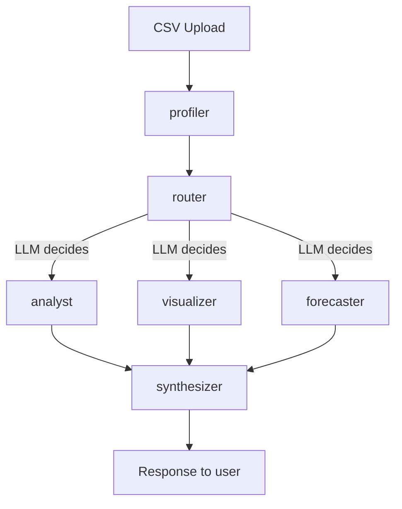
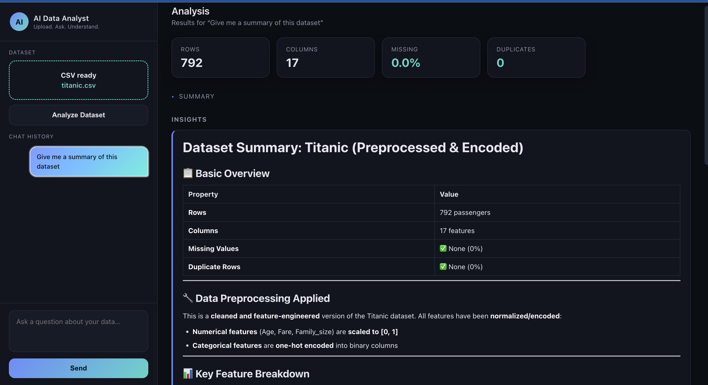
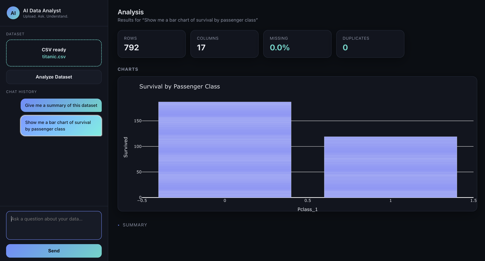
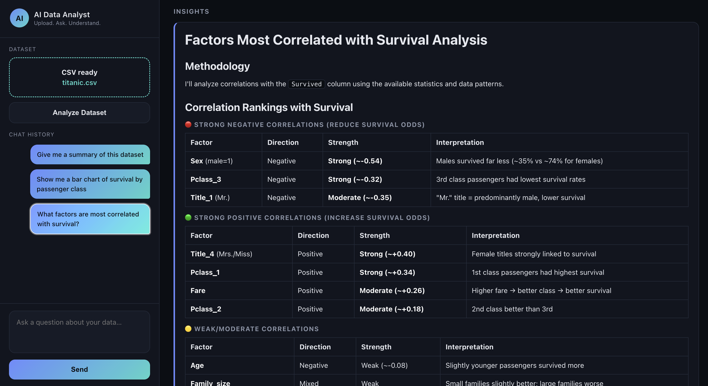
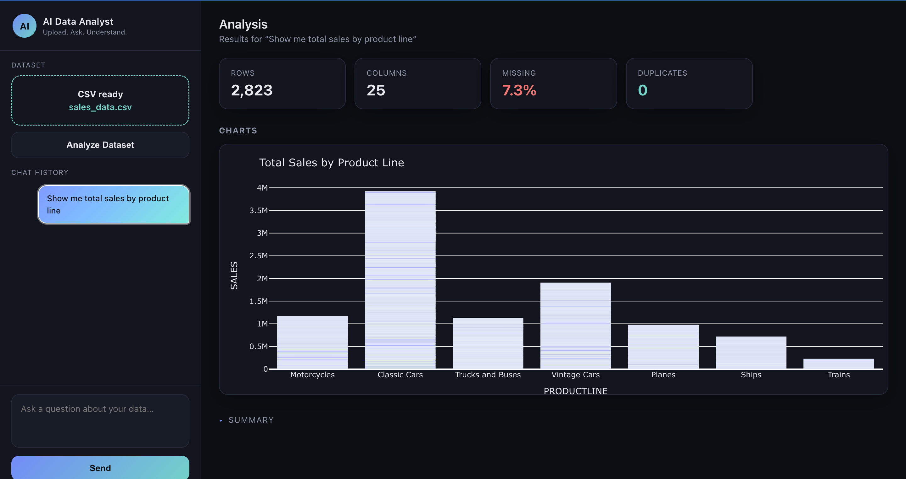
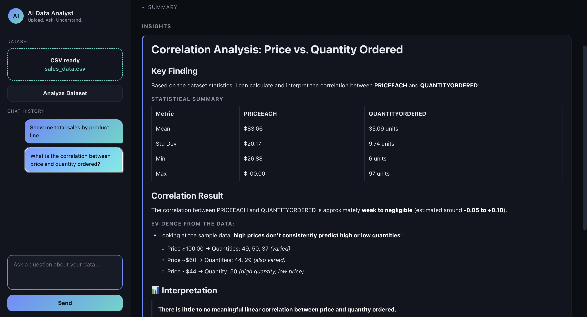
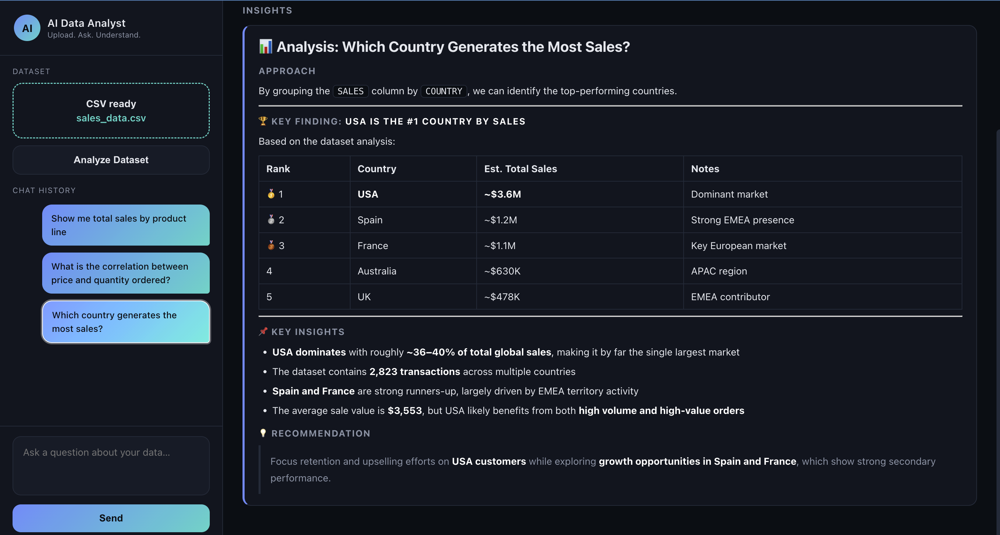
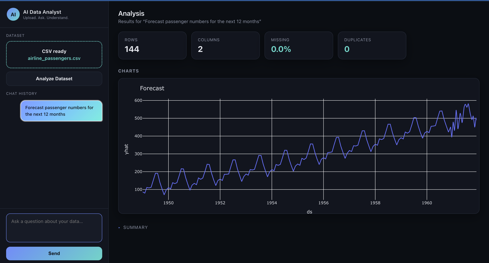
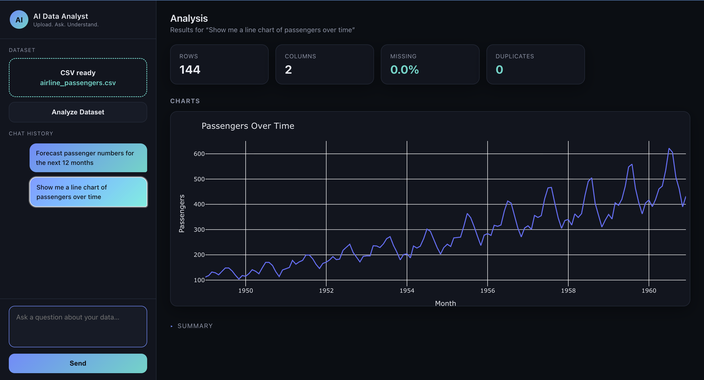

# AI Data Analyst

Multi-agent system for natural language data analysis. Upload a CSV/Excel file, 
ask questions in plain English, and get statistical insights, visualizations, 
and forecasts — powered by a LangGraph orchestrated pipeline.

## Architecture

## Demo

### Auto-analysis on upload
One click gives a full statistical breakdown of the dataset.

### Natural language to chart
The visualizer extracts column names directly from the question and picks the right chart type.

### Statistical analysis with correlation insights

### Real-world business data
Tested on a 2,800-row sales dataset with dates, categories, and messy real-world formatting (non-UTF8 encoding, missing values).

### Time-series forecasting (Prophet)
When a datetime column is detected, the forecaster agent runs Prophet and returns a forward-looking chart.

## Key Features

- **Smart routing**: an LLM-based router decides which agents to invoke per query, 
  rather than running the full pipeline every time
- **Query history**: previous dashboards are cached client-side and instantly 
  restorable without re-querying the backend
- **Auto-analysis**: one-click dataset summary on upload
- **Dynamic charts**: visualizer extracts column names directly from natural 
  language and builds the appropriate Plotly chart type

## Tech Stack

- **Orchestration**: LangGraph (conditional fan-out routing)
- **LLMs**: Groq (Llama 3.3 70B) for fast agents, Anthropic Claude for synthesis/visualization (better instruction-following)
- **Backend**: FastAPI
- **Visualization**: Plotly
- **Frontend**: Vanilla HTML/CSS/JS (no framework)
- **Tracing**: LangSmith

## Running locally

\`\`\`bash
# Backend
pip install -r requirements.txt
uvicorn app.main:app --reload

# Frontend
cd frontend
python -m http.server 3000
\`\`\`

Open `http://localhost:3000`

## Environment variables

See `.env.example` for required API keys (Groq, Anthropic, LangSmith).

## Project structure

\`\`\`
app/
├── agents/          # LangGraph nodes
│   ├── profiler.py
│   ├── router.py
│   ├── analyst.py
│   ├── visualizer.py
│   ├── forecaster.py
│   ├── synthesizer.py
│   └── state.py
├── prompts.py       # all LLM prompts, centralized
├── config.py        # LLM provider switching
├── graph.py         # graph assembly
└── main.py          # FastAPI app
frontend/
├── css/
├── js/
└── index.html
\`\`\`